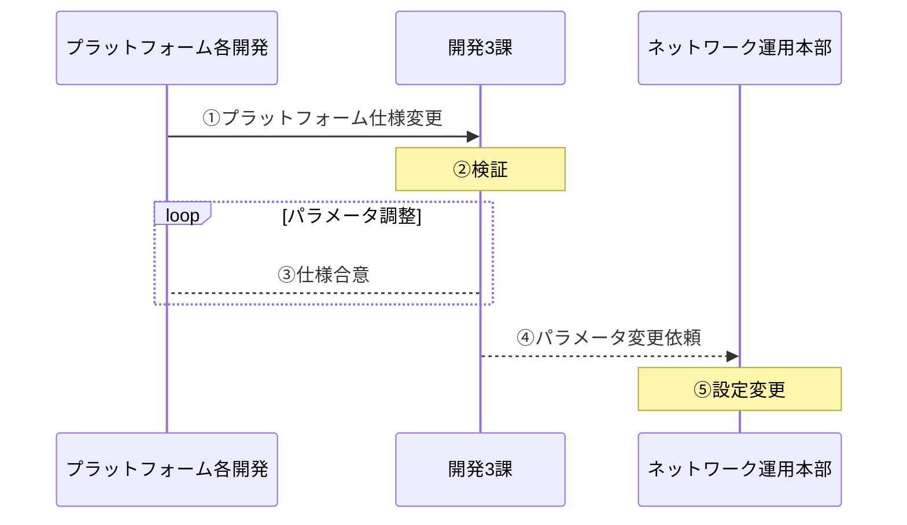
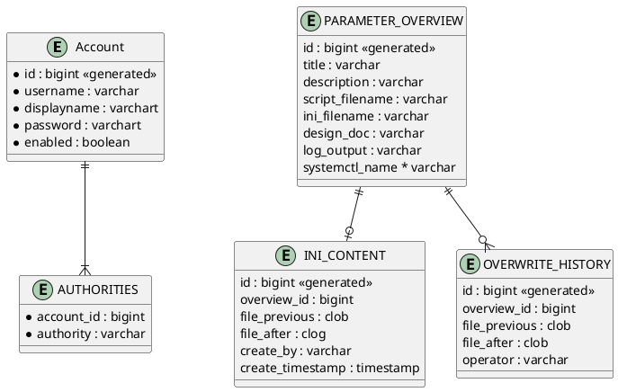
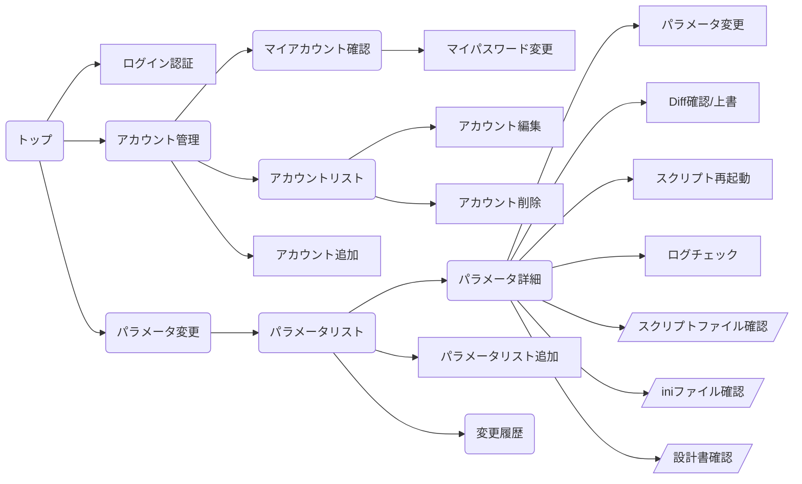
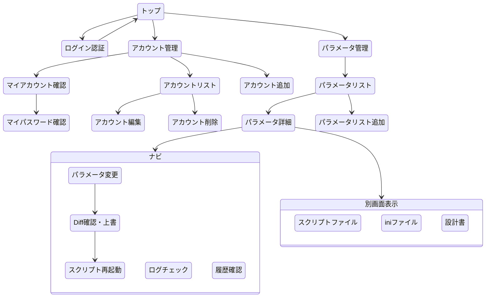

## システム概要

### シナリオ

### ビジネスロジック

### 業務フロー

#### ①：プラットフォーム仕様変更

正常性確認システムの監視対象（各プラットフォーム）の仕様変更や試験端末、試験用シミュレータの仕様変更により正常性確認の各タイマー値を変更する必要性が生じた場合、正常性確認システムのパラメータ変更依頼が起票される。

#### ②③：検証、仕様合意

変更依頼をベースに正常性確認システムの検証設備にて動作検証を実施する。
依頼元と動作結果を確認し、問題があるようであればパラメータを調整する。

#### ④：パラメータ変更依頼

合意した検証結果をもとに商用環境パラメータの変更依頼を起票する。

#### ⑤：設定作業

パラメータ変更依頼に従い、本システムを用いてパラメータの変更作業を実施する。

## システム構成

### 構成図

### ハードウェア、ソフトウェア構成図

### ネットワーク構成図

## 機能一覧

### 機能一覧表

|      機能分類      | 項番 |               機能               | 入力 | 照会 | 出力 |
|:------------------:|:----:|:--------------------------------:|:----:|:----:|:----:|
| スクリプト構成登録 |  1-1 | スクリプト構成一覧表示           |      |  〇  |      |
|                    |  1-2 | スクリプト構成登録               |  〇  |      |      |
|                    |  1-3 | スクリプト構成編集               |  〇  |      |      |
|                    |  1-4 | スクリプト構成削除               |  〇  |      |      |
| パラメータ参照     |  2-1 | スクリプト構成詳細表示               |      |  〇  |      |
|                    |  2-2 | スクリプト（pyhon）ソース表示    |      |  〇  |      |
|                    |  2-3 | パラメータ（ini）ソース表示      |      |  〇  |      |
| パラメータ登録     |  3-1 | パラメータ編集                   |  〇  |      |      |
|                    |  3-2 | パラメータ編集前後の差分表示     |      |  〇  |      |
|                    |  3-3 | パラメータ（ini）上書き          |  〇  |      |      |
|                    |  3-4 | Linuxコマンド（systemctl）キック |  〇  |      |      |
|                    |  3-5 | Linuxサービス ログ表示           |      |  〇  |      |
|                    |  3-6 | パラメータ編集（上書き）履歴表示 |      |  〇  |      |
| アカウント管理     |  4-1 | アカウント登録                   |  〇  |      |      |
|                    |  4-2 | アカウント編集                   |  〇  |      |      |
|                    |  4-3 | アカウント削除                   |  〇  |      |      |
|                    |  4-4 | アカウント一覧表示               |      |  〇  |      |
|                    |  4-5 | 自アカウント表示                 |      |  〇  |      |
|                    |  4-6 | 自アカウント パスワード変更      |  〇  |      |      |

### 入力データ一覧

|      機能分類      |       項目       | データ型 | 文字種 |                   入力制約その他                  |
|:------------------:|:----------------:|:--------:|:------:|:-------------------------------------------------:|
| アカウント         | アカウント名     | 文字列   | 半角   |                                                   |
|                    | パスワード       | 文字列   | 半角   |                                                   |
|                    | 表示名           | 文字列   | 半角   |                                                   |
|                    | 役割             | 文字列   | 半角   | ROLE_ADMIN / ROLE_USER / ROLE_SYS_ADMINのいずれか |
|                    | 有効/無効        | 論理     | --     |                                                   |
| スクリプトファイル | タイトル         | 文字列   | 全角   |                                                   |
|                    | 説明詳細         | 文字列   | 全角   |                                                   |
|                    | scriptファイル名 | 文字列   | 半角   | ディレクトリ名+ファイル名                         |
|                    | iniファイル名    | 文字列   | 半角   | ディレクトリ名+ファイル名                         |
|                    | 設計書ファイル名 | 文字列   | 半角   | ディレクトリ名+ファイル名                         |
|                    | ログファイル名   | 文字列   | 半角   | ディレクトリ名+ファイル名                         |
|                    | systemctl名      | 文字列   | 半角   |                                                   |

### 機能概要

#### スクリプト構成一覧表示

* 登録済みのスクリプト構成の概要をテーブルで一覧表示する。
* 表示する概要はタイトル、説明詳細の2項目。
* それぞれの概要からスクリプト構成詳細、スクリプト構成編集、スクリプト構成削除へリンクする。

#### スクリプト構成登録

## データベース仕様

### ER図

### テーブル定義

## UI設計

### 画面遷移図

### 画面レイアウト設計図

別紙
