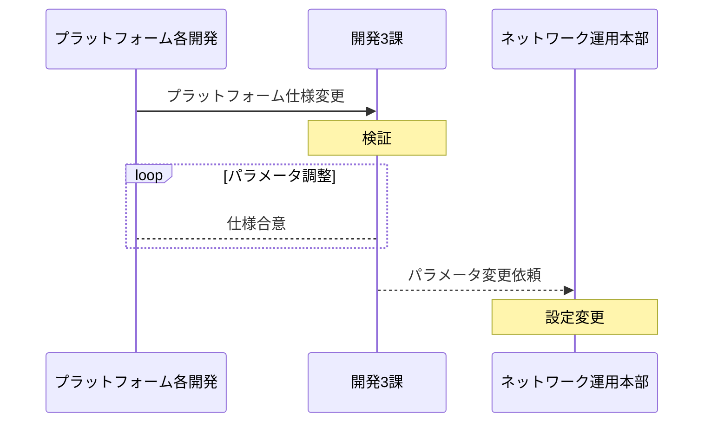
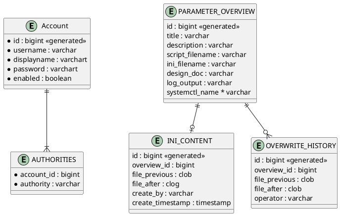
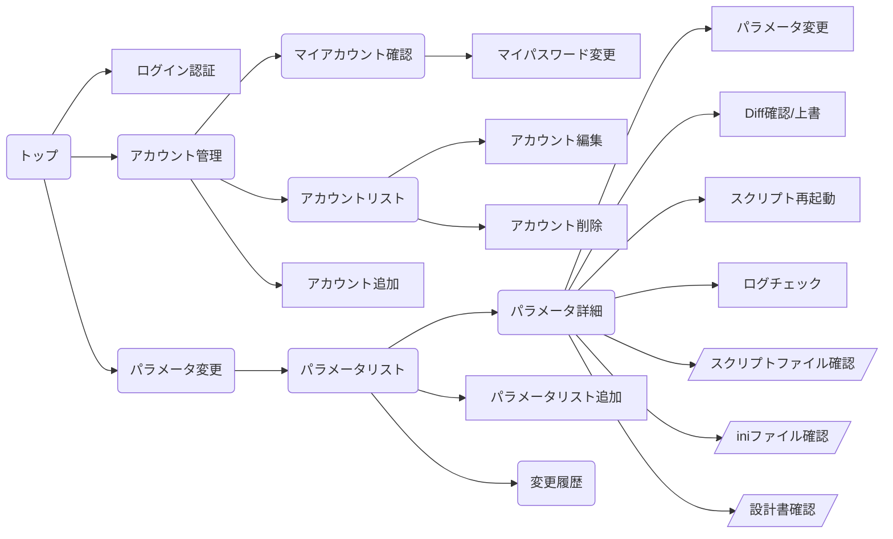

# 基本設計書

## システム概要

### シナリオ

### ビジネスロジック

### 業務フロー

```mermaid
sequenceDiagram
    participant A as プラットフォーム各開発
    participant B as 開発3課
    participant C as ネットワーク運用本部

    A->>B: プラットフォーム仕様変更
    Note over B: 検証
    loop パラメータ調整
        B-->A: 仕様合意
    end
    B-->>C: パラメータ変更依頼
    note over C: 設定変更

```

## システム構成

### 構成図

### ハードウェア、ソフトウェア構成図

### ネットワーク構成図

## 機能一覧表

## データベース仕様

### ER図

```puml
@startuml
entity "Account" as e01 {
    *id : bigint <<generated>>
    *username : varchar
    *displayname : varchart
    *password : varchart
    *enabled : boolean
}

entity "AUTHORITIES" as e02 {
    *account_id : bigint
    *authority : varchar
}

entity "PARAMETER_OVERVIEW" as e11 {
    id : bigint <<generated>>
    title : varchar
    description : varchar
    script_filename : varchar
    ini_filename : varchar
    design_doc : varchar
    log_output : varchar
    systemctl_name * varchar
}

entity "INI_CONTENT" as e12 {
    id : bigint <<generated>>
    overview_id : bigint
    file_previous : clob
    file_after : clog
    create_by : varchar
    create_timestamp : timestamp

}

entity "OVERWRITE_HISTORY" as e13 {
    id : bigint <<generated>>
    overview_id : bigint
    file_previous : clob
    file_after : clob
    operator : varchar
}

e01 ||--|{ e02
e11 ||--o| e12
e11 ||--o{ e13

@enduml
```

### テーブル定義

## UI設計

### 画面遷移図

```mermaid
graph LR;
top(トップ)-->ログイン認証;
top-->account(アカウント管理);
account-->myAccount(マイアカウント確認);
account-->accoutList(アカウントリスト);
account-->アカウント追加;
myAccount-->マイパスワード変更;
accoutList-->アカウント編集;
accoutList-->アカウント削除;

top-->parameter(パラメータ変更);
parameter-->parameterList(パラメータリスト);
parameterList-->parameterDetail(パラメータ詳細);
parameterList-->パラメータリスト追加;
parameterList-->parameterHistory(変更履歴);
parameterDetail-->パラメータ変更;
parameterDetail-->Diff確認/上書;
parameterDetail-->スクリプト再起動;
parameterDetail-->ログチェック;
parameterDetail-->showScript[/スクリプトファイル確認/];
parameterDetail-->showIni[/iniファイル確認/];
parameterDetail-->showDoc[/設計書確認/];
```

### 画面レイアウト設計図
