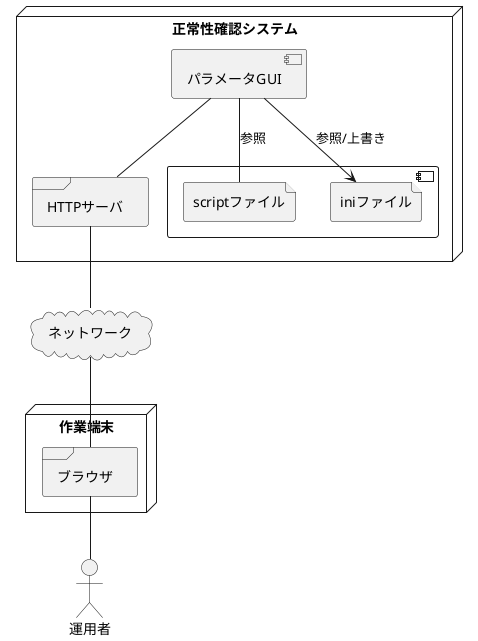
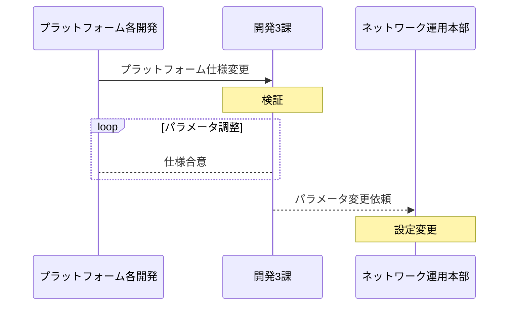
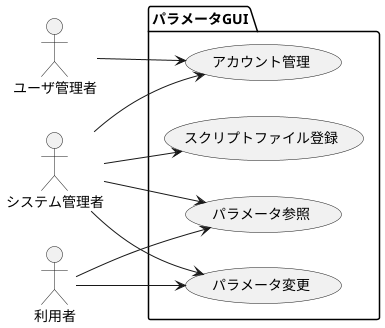

## システム概要

### システムの目的

IoT各プラットフォームの死活監視を行っている正常性確認システムは、監視対象となるシステムごとにpython scriptがサービスとして起動されている。
このpython scriptは監視対象を監視する際の通信間隔、タイムアウト、リトライ回数等の各パラメータをiniファイルとして別に保存している。

IoTプラットフォームや監視パケット生成のシミュレータ等で仕様変更が発生した際、現運用では正常性確認システム開発担当においてパラメータの調整から本番環境のiniファイル変更まで行っており、開発担当者の負荷となっている。

本番環境のパラメータ変更は、変更作業がコンソール画面での実ファイル置き換えという変更箇所が分かりづらく、また履歴が残らない方法であるため、開発担当以外で作業を行いづらいという背景がある。

この変更作業を変更項目が分かりやすく、また作業履歴が残るようGUI化を行い、同作業を運用部門に移管することにより、開発担当者の負荷の軽減を図る。

## システム構成

### システム概念図

### 業務フロー

### ユースケース図

## 機能要件

### 機能一覧

|        機能分類        |               機能               | 入力 | 照会 | 出力 |
|:----------------------|:--------------------------------|:----:|:----:|:----:|
| スクリプトファイル登録 | スクリプト一覧表示               |      |  〇  |      |
|                        | スクリプト登録                   |  〇  |      |      |
|                        | スクリプト編集                   |  〇  |      |      |
|                        | スクリプト削除                   |  〇  |      |      |
| パラメータ参照         | スクリプト詳細表示               |      |  〇  |      |
|                        | スクリプト（pyhon）ソース表示    |      |  〇  |      |
|                        | パラメータ（ini）ソース表示      |      |  〇  |      |
| パラメータ登録         | パラメータ編集                   |  〇  |      |      |
|                        | パラメータ編集前後の差分表示     |      |  〇  |      |
|                        | パラメータ（ini）上書き          |  〇  |      |      |
|                        | Linuxコマンド（systemctl）キック |  〇  |      |      |
|                        | Linuxサービス ログ表示           |      |  〇  |      |
|                        | パラメータ編集（上書き）履歴表示 |      |  〇  |      |
| アカウント管理         | アカウント登録                   |  〇  |      |      |
|                        | アカウント編集                   |  〇  |      |      |
|                        | アカウント削除                   |  〇  |      |      |
|                        | アカウント一覧表示               |      |  〇  |      |
|                        | 自アカウント表示                 |      |  〇  |      |
|                        | 自アカウント パスワード変更      |  〇  |      |      |

## 入出力要件

### 入力データ一覧

|      機能分類      |       項目       | データ型 | 文字種 |                   入力制約その他                  |
|:------------------:|:----------------:|:--------:|:------:|:-------------------------------------------------:|
| アカウント         | アカウント名     | 文字列   | 半角   |                                                   |
|                    | パスワード       | 文字列   | 半角   |                                                   |
|                    | 表示名           | 文字列   | 半角   |                                                   |
|                    | 役割             | 文字列   | 半角   | ROLE_ADMIN / ROLE_USER / ROLE_SYS_ADMINのいずれか |
|                    | 有効/無効        | 論理     | --     |                                                   |
| スクリプトファイル | タイトル         | 文字列   | 全角   |                                                   |
|                    | 説明詳細         | 文字列   | 全角   |                                                   |
|                    | scriptファイル名 | 文字列   | 半角   | ディレクトリ名+ファイル名                         |
|                    | iniファイル名    | 文字列   | 半角   | ディレクトリ名+ファイル名                         |
|                    | 設計書ファイル名 | 文字列   | 半角   | ディレクトリ名+ファイル名                         |
|                    | ログファイル名   | 文字列   | 半角   | ディレクトリ名+ファイル名                         |
|                    | systemctl名      | 文字列   | 半角   |                                                   |

## 非機能要件

別紙

### セキュリティ要件

別紙

### 品質・性能要件

別紙
