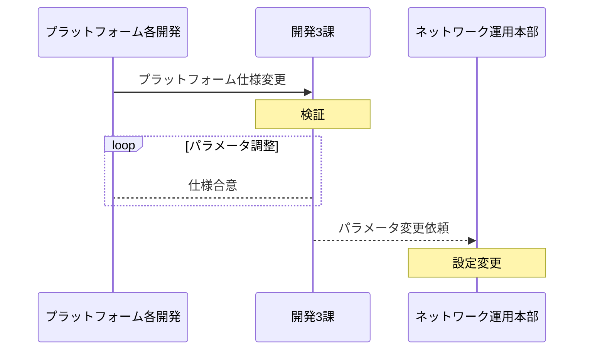
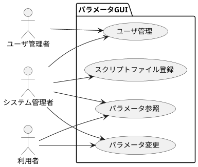

# 要求仕様書

## システム概要

### 目的

IoT各プラットフォームの死活監視を行っている正常性確認システムは、監視対象となるシステムごとにpython scriptがサービスとして起動されている。
このpython scriptは監視対象を監視する際の通信間隔、タイムアウト、リトライ回数等の各パラメータをiniファイルとして別に保存している。

IoTプラットフォームや監視パケット生成のシミュレータ等で仕様変更が発生した際、現運用では正常性確認システム開発担当においてパラメータの調整から本番環境のiniファイル変更まで行っており、開発担当者の負荷となっている。

本番環境のパラメータ変更は、変更作業がコンソール画面での実ファイル置き換えという変更箇所が分かりづらく、また履歴が残らない方法であるため、開発担当以外で作業を行いづらいという背景がある。

この変更作業を変更項目が分かりやすく、また作業履歴が残るようGUI化を行い、同作業を運用部門に移管することにより、開発担当者の負荷の軽減を図る。

## システム構成

### システム概念図

### 業務フロー

### ユースケース図

## 機能要件

### 機能一覧

## 入出力要件

### 入力データ一覧

### 出力データ一覧

## 非機能要件

### セキュリティ要件

### 品質・性能要件
